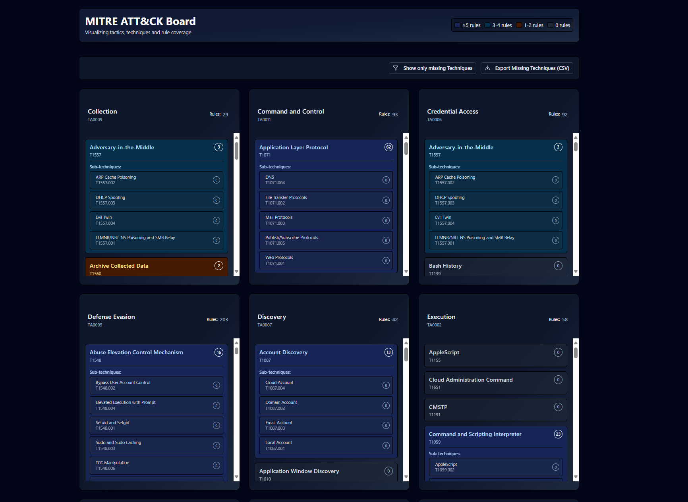

# Mitre ATT&CK Board

<!-- Add your screenshot here -->


## Overview

mitreBoard is a web application designed to visualize the MITRE ATT&CK® framework's tactics and techniques. It allows you to map your custom analytic rules (in YAML format) to specific MITRE techniques, providing a clear overview of your detection coverage.

Key features:
*   Displays MITRE ATT&CK tactics and techniques in a structured board format.
*   Parses YAML analytic rules from a specified directory.
*   Maps rules to techniques based on the `relevantTechniques` field in the YAML.
*   Shows the number of rules covering each technique and sub-technique.
*   Allows viewing the content of rules associated with a technique.
*   Provides an option to filter the view to show only techniques with zero rule coverage.
*   Exports a list of techniques with missing coverage to a CSV file.

## Getting Started

### Prerequisites

*   [Bun](https://bun.sh/) (for development and building)
*   A directory containing your analytic rules in YAML format.

### Development

1.  **Clone the repository:**
    ```bash
    git clone <your-repo-url>
    cd mitreBoard/mitre-board-app
    ```
2.  **Install dependencies:**
    ```bash
    bun install
    ```
3.  **Run the development server:**
    Replace `./path/to/your/rules` with the actual path to your rule directory. The `-d` or `--directory` flag is required.
    ```bash
    bun run dev --directory ./path/to/your/rules
    ```
    The application will be available at `http://localhost:3000` (or the configured port).

### Using Compiled Executable

1.  Build the application for your target system using `bun run build` (see `package.json` build scripts) or download a pre-built release.
2.  Run the executable, providing the path to your rule directory using the `-d` or `--directory` flag:

    *   **Linux/macOS:**
        ```bash
        ./mitre-board-<system-arch> -d ./path/to/your/rules
        ```
        *(Replace `<system-arch>` with your specific architecture, e.g., `linux-x64-modern`, `mac-arm64`)*
    *   **Windows:**
        ```bash
        .\mitre-board-windows-x64-modern.exe -d C:\path\to\your\rules
        ```

## Analytic Rule YAML Schema

The application expects analytic rules in YAML format within the specified directory (recursively). Each rule file should contain at least the following fields for mapping:

```yaml
id: <unique_rule_identifier>          # Required: A unique string ID for the rule.
name: <Rule Name>                     # Recommended: A human-readable name/title for the rule. Used in the UI if 'title' is missing.
description: <Rule Description>       # Optional: A brief description of what the rule does. Used in the UI.
tactics:                      # Required: A list of MITRE ATT&CK tactic IDs (e.g., TA0001, TA0002 or Collection, Credential Access) covered by this rule.
  - Collection
  - Credential Access
relevantTechniques:                   # Required: A list of MITRE ATT&CK technique IDs (e.g., T1098, T1548.002) covered by this rule.
  - T1098
  - T1548.002
# Other fields like severity, tactics, query, etc., can be included but are not strictly required for mapping or basic display.
```

See the `rules/rule4.yaml` file for a more detailed example.

## Missing Techniques CSV Output Format

The "Export Missing Techniques (CSV)" feature generates a CSV file listing all base techniques (not sub-techniques) that currently have zero associated rules based on the parsed files. The CSV file has the following columns:

```csv
TacticName,TacticNumber,TechniqueNumber,TechniqueTitle
"Persistence","TA0003","T1098","Account Manipulation"
"Privilege Escalation","TA0004","T1548","Abuse Elevation Control Mechanism"
```

*   **TacticName:** The name of the MITRE Tactic associated with the technique.
*   **TacticNumber:** The ID of the MITRE Tactic (e.g., TA0003).
*   **TechniqueNumber:** The ID of the MITRE Technique (e.g., T1098).
*   **TechniqueTitle:** The name of the MITRE Technique.

## Tech Stack

*   **Frontend:** React, TypeScript
*   **Backend/Runtime:** Bun
*   **Styling:** Tailwind CSS
*   **UI Components:** shadcn/ui (built on Radix UI)
*   **YAML Parsing:** `yaml` library
*   **CLI Arguments:** `commander`
