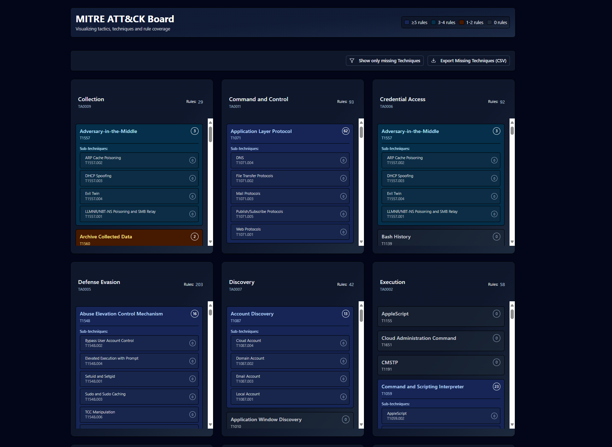
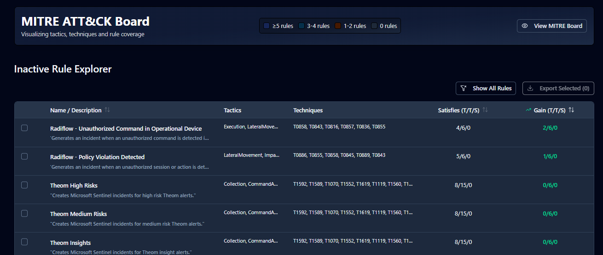

# Mitre ATT&CK Board

<!-- Add your screenshot here -->


## Overview

mitreBoard is a web application designed to visualize the MITRE ATT&CK® framework's tactics and techniques. It allows you to map your custom analytic rules (in YAML format) to specific MITRE techniques, providing a clear overview of your detection coverage.

Key features:
*   Displays MITRE ATT&CK tactics and techniques in a structured board format.
*   Parses YAML analytic rules from a specified directory.
*   Maps rules to techniques based on the `relevantTechniques` field in the YAML.
*   Shows the number of rules covering each technique and sub-technique.
*   Allows viewing the content of rules associated with a technique.
*   Provides an option to filter the view to show only techniques with zero rule coverage.
*   Exports a list of techniques with missing coverage to a CSV file.
*   **External Rule Sources**: Fetches analytical rules from configured GitHub repositories (e.g., Azure Sentinel rules).
*   **Rule Caching**: Caches downloaded rules locally to improve performance and reduce API calls.
*   **Configurable Repositories**: Rule sources are defined in `mitre-board-app/rule-sources.config.json`, allowing easy addition or modification of GitHub repositories.
*   Includes an "Inactive Rule Explorer" to review rules from all sources (local and GitHub) that are not currently active, allowing you to assess their potential coverage gain.

## External Rule Sources & Caching

The application can be configured to download analytical rules directly from GitHub repositories. This is useful for integrating rules from community or commercial sources like Azure Sentinel.

*   **Configuration**: Define your GitHub rule sources in the `mitre-board-app/rule-sources.config.json` file. Each entry specifies the repository owner, name, base path for rules, and specific folders to scan.
*   **Fetching**: On startup, the application fetches rules from these configured sources.
*   **Caching**: To speed up subsequent launches and minimize GitHub API usage, fetched rules are cached locally in the `.github-rule-cache` directory within `mitre-board-app`. The application can be configured to prefer cached rules for faster development iterations.
*   **`GITHUB_PAT` for Rate Limiting**: To avoid GitHub API rate limits, especially with public repositories or frequent fetching, it's highly recommended to create a GitHub Personal Access Token (PAT) with `repo` scope (or `public_repo` if only accessing public repositories). Set this token as an environment variable named `GITHUB_PAT` in a `.env` file within the `mitre-board-app` directory:
    ```
    GITHUB_PAT=your_github_personal_access_token
    ```
    The application will automatically use this token for authenticated API requests.
    Once you have the rules downloaded and would like just to run the app add the `--prefer-cache` flag when running the app. This will utilize the existing `..github-rule-cache` folder for existing rules.

## Inactive Rule Explorer

This view helps you analyze analytic rules that exist in your rule directory but are not currently considered "active" by the system (determined via the `/api/inactive-rules` endpoint). It's useful for identifying potential rules to enable.



Key features of the explorer:
*   Lists inactive rules with their names, descriptions, and the MITRE Tactics/Techniques/Sub-techniques they satisfy.
*   Allows selecting rules to simulate enabling them.
*   Calculates and displays the **Incremental Gain** (new Tactic/Technique/Sub-technique coverage) each rule would provide *if enabled*, considering both currently active rules and other selected inactive rules.
*   Provides a filter to show only **Effective Rules** – those that offer a positive incremental gain for at least one Tactic, Technique, or Sub-technique.
*   Allows sorting rules by name, total satisfied items, or incremental gain.
*   Enables viewing the raw content of any inactive rule.
*   Exports a CSV detailing the specific coverage **gain** provided by the selected inactive rules.

### Inactive Rules Gain Export CSV Format

The "Export Selected" feature in the Inactive Rule Explorer generates a CSV file detailing the *additional* coverage gained by enabling the selected rules, considering the baseline coverage from already active rules.

```csv
Rule Name,Rule ID,Gained Tactics,Gained Techniques,Gained SubTechniques
"My Inactive Rule 1","rule-abc","TA0005","T1078",""
"My Inactive Rule 2","rule-xyz","","","T1059.001, T1059.003"
```

*   **Rule Name:** The name/title of the selected inactive rule.
*   **Rule ID:** The unique identifier of the rule.
*   **Gained Tactics:** Comma-separated list of Tactic IDs (e.g., TA0005) for which this rule provides *new* coverage.
*   **Gained Techniques:** Comma-separated list of Technique IDs (e.g., T1078) for which this rule provides *new* coverage.
*   **Gained SubTechniques:** Comma-separated list of Sub-technique IDs (e.g., T1059.001) for which this rule provides *new* coverage.

*(Empty fields indicate no *new* coverage was gained for that category by that specific rule, given the baseline and other selections.)*

## Getting Started

### Prerequisites

*   [Bun](https://bun.sh/) (for development and building)
*   A directory containing your analytic rules in YAML format.

### Development

1.  **Clone the repository:**
    ```bash
    git clone <your-repo-url>
    cd mitreBoard/mitre-board-app
    ```
2.  **Install dependencies:**
    ```bash
    bun install
    ```
3.  **Run the development server:**
    Replace `./path/to/your/rules` with the actual path to your rule directory. The `-d` or `--directory` flag is required.
    ```bash
    bun run dev --directory ./path/to/your/rules
    ```
    The application will be available at `http://localhost:3000` (or the configured port).

### Using Compiled Executable

1.  Build the application for your target system using `bun run build` (see `package.json` build scripts) or download a pre-built release.
2.  Run the executable, providing the path to your rule directory using the `-d` or `--directory` flag:

    *   **Linux/macOS:**
        ```bash
        ./mitre-board-<system-arch> -d ./path/to/your/rules
        ```
        *(Replace `<system-arch>` with your specific architecture, e.g., `linux-x64-modern`, `mac-arm64`)*
    *   **Windows:**
        ```bash
        .\mitre-board-windows-x64-modern.exe -d C:\path\to\your\rules
        ```

## Analytic Rule YAML Schema

The application expects analytic rules in YAML format within the specified directory (recursively). Each rule file should contain at least the following fields for mapping:

```yaml
id: <unique_rule_identifier>          # Required: A unique string ID for the rule.
name: <Rule Name>                     # Recommended: A human-readable name/title for the rule. Used in the UI if 'title' is missing.
description: <Rule Description>       # Optional: A brief description of what the rule does. Used in the UI.
tactics:                      # Required: A list of MITRE ATT&CK tactic IDs (e.g., TA0001, TA0002 or Collection, Credential Access) covered by this rule.
  - Collection
  - Credential Access
relevantTechniques:                   # Required: A list of MITRE ATT&CK technique IDs (e.g., T1098, T1548.002) covered by this rule.
  - T1098
  - T1548.002
# Other fields like severity, tactics, query, etc., can be included but are not strictly required for mapping or basic display.
```

See the `rules/rule4.yaml` file for a more detailed example.

## Missing Techniques CSV Output Format

The "Export Missing Techniques (CSV)" feature generates a CSV file listing all base techniques (not sub-techniques) that currently have zero associated rules based on the parsed files. The CSV file has the following columns:

```csv
TacticName,TacticNumber,TechniqueNumber,TechniqueTitle
"Persistence","TA0003","T1098","Account Manipulation"
"Privilege Escalation","TA0004","T1548","Abuse Elevation Control Mechanism"
```

*   **TacticName:** The name of the MITRE Tactic associated with the technique.
*   **TacticNumber:** The ID of the MITRE Tactic (e.g., TA0003).
*   **TechniqueNumber:** The ID of the MITRE Technique (e.g., T1098).
*   **TechniqueTitle:** The name of the MITRE Technique.

## Tech Stack

*   **Frontend:** React, TypeScript
*   **Backend/Runtime:** Bun
*   **Styling:** Tailwind CSS
*   **UI Components:** shadcn/ui (built on Radix UI)
*   **YAML Parsing:** `yaml` library
*   **CLI Arguments:** `commander`
